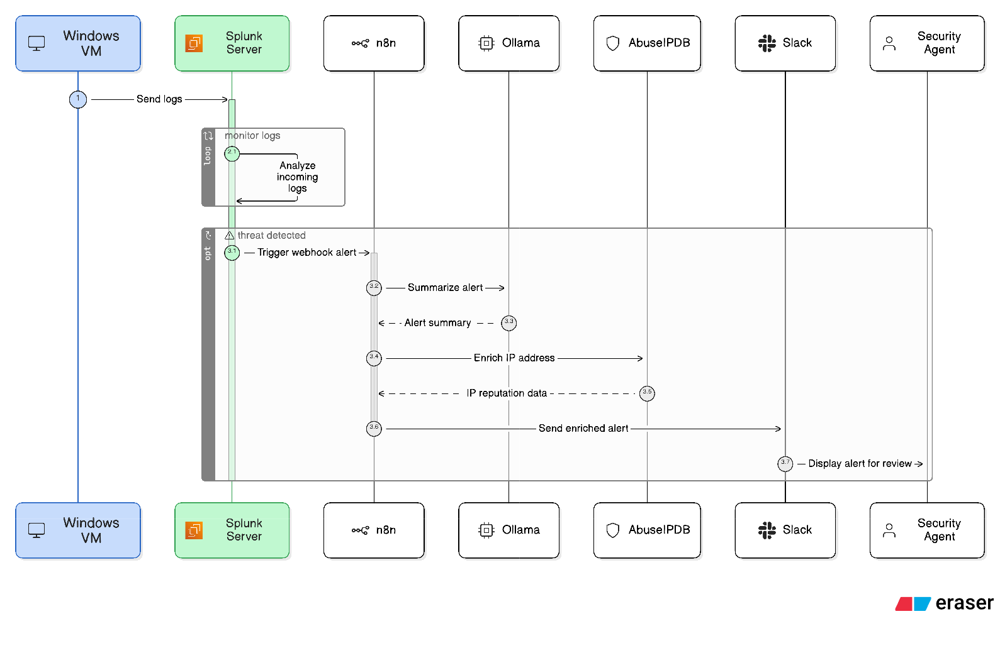
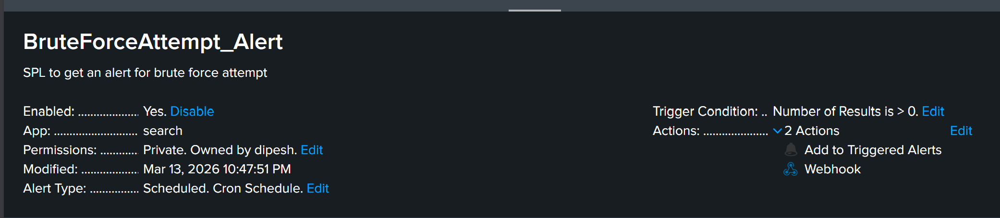
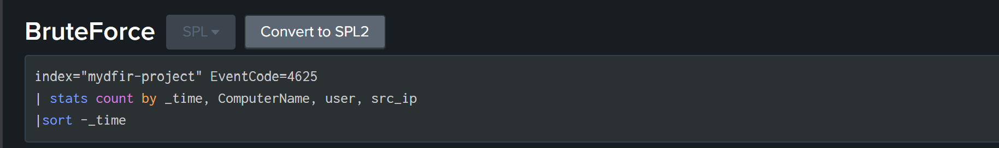
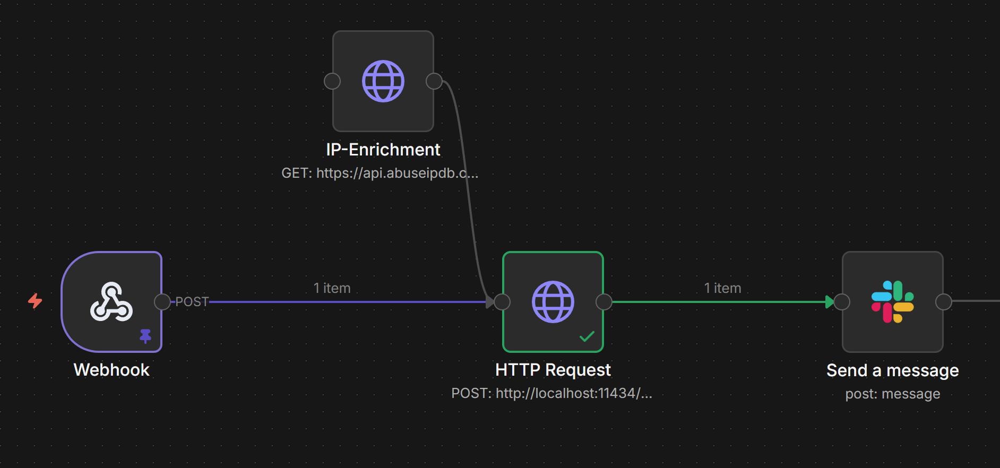
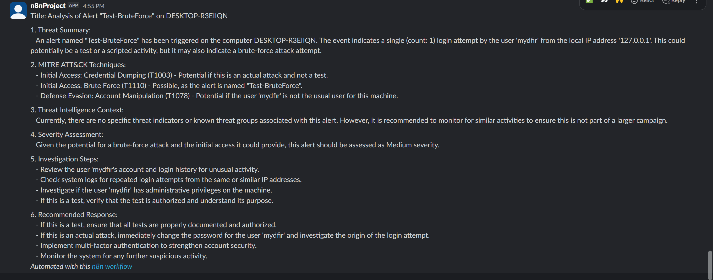

# AI-SOC-Automation
Automated alerts are generated by Splunk using n8n and sent to a Slack channel for the agent to review. The alert is summarized by Ollama and then sent to the user on Slack.

# AI SOC Automation with Splunk, n8n, and Ollama

This project demonstrates a Security Operations Center (SOC) automation pipeline that detects suspicious activity and performs automated incident analysis using AI.

## Architecture

## Workflow

1. Windows security events are collected by Splunk.
2. Splunk detection rules trigger alerts.
3. Alerts are sent to n8n using a webhook.
4. n8n enriches the attacker IP using AbuseIPDB.
5. Ollama performs AI-based incident analysis.
6. Slack receives automated SOC notifications.

## Technologies Used

- Splunk (SIEM)
- n8n (workflow automation)
- Ollama (local LLM AI analysis)
- AbuseIPDB (threat intelligence)
- Slack API (alerting)

## Example Detection
index=* EventCode=4625
| stats count by Account_Name, src_ip
| where count > 5
Detects brute-force login attempts.

## Features

- Automated SIEM alert ingestion
- IP threat intelligence enrichment
- AI-generated incident analysis
- Automated SOC notifications

## Demo

### Splunk Alert

### Splunk Query

### n8n Workflow

### SOC Alert in Slack

## Demo Workflow

1. A brute-force login attempt occurs on a Windows machine.
2. Splunk detects multiple failed authentication attempts.
3. Splunk alert sends event data to n8n via webhook.
4. n8n enriches the source IP using AbuseIPDB.
5. Ollama analyzes the alert and generates a SOC incident report.
6. The alert is automatically sent to Slack.

## Setup

1. Install Splunk
2. Configure Splunk alert webhook
3. Import the n8n workflow
4. Install Ollama and the Mistral model
5. Configure Slack webhook
